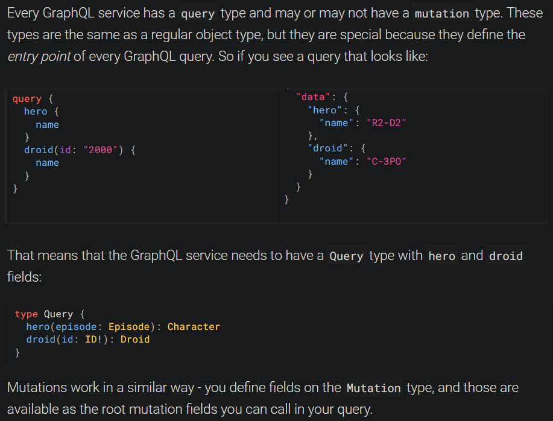

# hackernews-typescript-graphql
 Following GraphQL Tutorial

 https://www.howtographql.com/typescript-apollo/1-getting-started/ 

Apollo Server: Fully-featured GraphQL Server 

Nexus: A library for creating robust, type-safe GraphQL schemas using JavaScript/TypeScript.

Prisma: Used to access your database inside of GraphQL resolvers.

### Progress
1. Started learning how GraphQL server works, defining GraphQL schema for the server using Nexus and wrote the corresponding resolver functions (resolver functions essentially provide a response to a GraphQL Query).These resolvers to start with, only worked with data stored in memory (nothing was saved after runtime of server).

2. Added SQLite database managed with Prisma

3. Start adding more advanced features to the API
	- Implementing signup/login functionality (authenticate users against API, also allow us to check permissions of users for certain API operations)
	- Add vote feature

#Notes
1. Every GraphQL service has a query type and sometimes mutation type. These are same as regular object types, but they define the entry point of every GraphQL query. 

